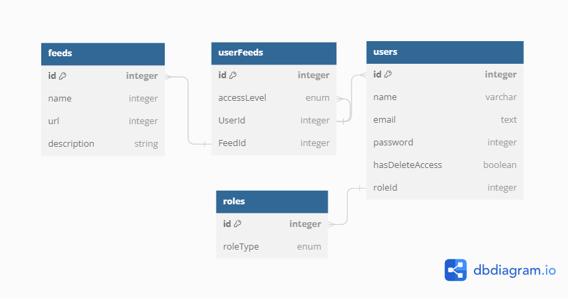

# ER Diagram of database



## how to install 

clone this repo
```bash
git clone https://github.com/Varunmnx/adeodist.git
```
install all dependencies
```bash
npm install
```

create a .env file
```bash
SERVER_PORT = 3500
MYSQLDB_USER= 
MYSQLDB_ROOT_PASSWORD=
MYSQLDB_DATABASE=
MYSQLDB_LOCAL_PORT=
MYSQLDB_DOCKER_PORT=
DB_HOST = localhost
JWT_SECRET = 
```

install mysql ( i have used mysql docker container so kindly use that to avoid any issues )
```bash
docker pull mysql:latest
```

run mysql docker container using your docker command
```bash
 docker run --name my-sql -d -p 3306:3306 -e MYSQL_ROOT_PASSWORD="mypass" mysql:latest
```
create a new database
```bash
# login as root user
mysql -u root -p

# create a database 
CREATE DATABASE adeodist;
```

run the project
```bash
npm run dev
```

# your Admin credentials
```bash
      email: "admin@gmail.com",
      password: "Admin@123",
```

